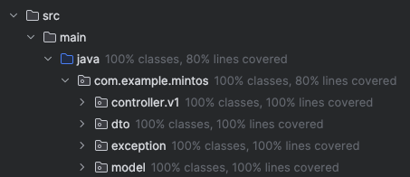

# Mintos Test Assignment

Non-functional requirements:
1. Test coverage should be not less than 80% - Got the test coverage to 80% 
   2. 
2. Implemented web service should be resilient to 3rd party service unavailability:
   1. Using `RetryTemplate` to retry the Exchange Rate API HTTP requests for 5 times 
   2. Using timeouts of 5 seconds for the HTTP request to the Exchange Rate API
   3. Caching - Persisting the exchange rates in case of unavailability of the API to work with the latest available rates
3. DB schema versioning should be implemented - Here I used **Liquibase** to version the database schema.

## Running the project

1. Create database called mintos
2. Create a file under `src/main/resources/secrets.properties` with the following content and replace the placeholder with the https://exchangeratesapi.io API key

```properties
api.key=<the API key>
```

3. Run the app with Intellij IDEA or the Maven CLI

```bash
mvn spring-boot:run
```

4. Open up the Postman collection or use the http://localhost:8080/ URL in the browser to make the API calls that are listed below.

The application will create the necessary database tables and add sample accounts to the accounts table. 
It's possible to make transfers only from the EUR accounts as that's the API limitation from the API in use (https://api.exchangerate.host/latest)

## List of API requests
I've added a Postman collection to the project so that you could easily import the collection to make the API requests.


### Get Transaction history 

Path: `GET /v1/transactions/history/{accountID}`

Given an account identifier, return transaction history (last transactions come first)
and support result paging using “offset” and “limit” parameters

Note: If you have two transactions, pass `offset = 1`, `limit = 1` to get the older one
and just `limit=1` or with `offset=0` to get the newer one

### Make a transfer 

Path: `POST /v1/transactions/create`

Transfer funds between two accounts indicated by identifiers (Balance will always be positive (>= 0).)

Currency conversion takes place when transferring funds between accounts with
different currencies
1. For currency exchange rates, the following service is used: https://api.exchangerate.host
2. The supported currency limitation is that it's possible to make transfers only from the EUR accounts
3. The currency of funds in the transfer operation will match the receiver's account currency (e.g. system should return an error when requesting to transfer 30 GBP from a USD account to a EUR account, however transferring 30 GBP from USD to GBP is a valid operation - corresponding amount of USD is exchanged to GBP and credited to GBP account).

### Find an account by client ID
Path: `GET /v1/accounts/find/clientID/{clientID}`

Given a client identifier, return a list of accounts (each client might have 0 or more
accounts with different currencies)

### Extra call: get list of all accounts

Path: `GET /v1/accounts`


